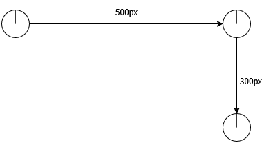

# CSE435 – Robotics  
## Lab 1 - Introduction to RobotBasic Simulator

## General Notes

- Commands in RobotBASIC are **not case-sensitive**.  
- The simulator “run screen” is **800 × 600 pixels** (width × height).  
- Parameters in square brackets `[ ]` are optional. If omitted, RobotBASIC uses defaults.  
- The screen origin `(0,0)` is **top-left**. Increasing `x` moves right, increasing `y` moves down.  

---

## 1. Initializing a Robot

```basic
rLocate x, y, [heading, size, color]
```

| Parameter | Meaning / Default | Notes |
|-----------|-------------------|-------|
| **x, y** | Coordinates in the screen | x,y are coordinates of the center of the robot |
| **heading** | Direction in degrees | Default = 0 (facing upward). Positive values clockwise |
| **size** | Diameter in pixels | Default = 20 (range 5 → 50) |
| **color** | Color of the robot | Default = blue |

**Examples:**
```basic
rLocate 400, 300
rLocate 100, 100, 45, 30, red
```

**To print x and y values**
```basic
print(rGpsY())
print(rGpsY())
```

---

## 2. Animating the Robot

### Moving Forward / Backward
```basic
rForward value
```
- `value` in pixels.  
- Positive → move forward.  
- Negative → move backward.  

### Turning
```basic
rTurn dvalue
```
- `dvalue` in degrees.  
- Positive → clockwise.  
- Negative → counterclockwise.  

---

## 3. Controlling Robot Speed

```basic
rSpeed value
```

- Range: **1 → 100**.  
- Default: **10**.  
- Larger value = **slower movement** (easier to observe).  
- Smaller value = **faster movement**.  

**Example**  
<p style="text-align: center">
  
</p>

---

## 4. Drawing Obstacles / Shapes

### Circle
```basic
circle x1, y1, x2, y2, [outlineColor, fillColor]
```
- `(x1, y1)` and `(x2, y2)` define the **bounding rectangle** of the circle/ellipse.  
- Optional: outline color and fill color.  

### Rectangle
```basic
rectangle x1, y1, x2, y2, [outlineColor, fillColor]
```
- `(x1, y1)` = upper-left corner.  
- `(x2, y2)` = lower-right corner.  
- Optional: outline color and fill color.  
