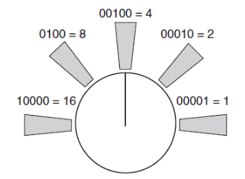

# CSE435 – Robotics
## Lab 2 – RobotBASIC Sensors

---

### 🧠 General Overview

* The robot in **RobotBASIC** has several sensors that let it *feel* and *see* its environment.
* Programs use sensor data to make decisions — e.g., avoid collisions, follow targets, or locate goals.
* This lab introduces **sensor-based control** and key **programming constructs** in RobotBASIC.

---

## 1. Programming Constructs in RobotBASIC

### Case Sensitivity

* RobotBASIC is **not case-sensitive** for keywords (`IF`, `if`, `If` all work).
* However, **variable names**, **array names**, and **labels** *are* case-sensitive.

### Comments

```basic
// This is a comment
```

* Anything following `//` on a line is ignored by the interpreter.

---

### Conditional Statements

**Single-line form**

```basic
if condition then action
```

* Executes the action only if the condition is true.

**Multi-line form**

```basic
if condition
   action1
   action2
endif
```

**With else**

```basic
if condition
   action1
else
   action2
endif
```

**Comparison operators**

| Operator | Meaning               |
| -------- | --------------------- |
| `>`      | greater than          |
| `<`      | less than             |
| `=`      | equal to              |
| `<>`     | not equal             |
| `<=`     | less than or equal    |
| `>=`     | greater than or equal |

---

### Loops

**For Loop**

```basic
for I = 1 to 10
   print I
next
```

**While Loop**

```basic
K = 0
while K <> Ascii("q")
   print Random(1000)
   waitkey K
wend
```

* Use **`break`** to exit a loop early.

---

### Output Commands

**Print to screen**

```basic
print Expr
print Expr, Expr
print Expr; Expr
```

* `,` → no space
* `;` → adds a tab space

**Print at specific coordinates**

```basic
XYString X, Y, Expr[, Expr; ...]
```

* Similar to `print`, but text appears at `(X, Y)` without scrolling.

---

## 2. Collision Detection with Bumpers

* The robot has **four bumper sensors** around its perimeter.
* Function:

  ```basic
  rBumper()
  ```

  Returns a number representing which bumpers are pressed (0 = none).

<p align="center">
  
</p>

**Example – Stop on Collision**

```basic
rLocate 400, 300

while rBumper() = 0
   rForward 1
wend
```

---

## 3. Object Detection Sensors

### 🔹 Infrared (IR) Sensors

* Detect obstacles **without touching** them.
* Work by emitting IR light and detecting reflections.
* Function:

  ```basic
  rFeel()
  ```

<p align="center">
  
</p>

**Example – Stop when Object Detected**

```basic
rLocate 400, 300

while rFeel() = 0
   rForward 1
wend
```


---

### 🔹 Ranging Sensor (Ultrasonic / Infrared)

* Detects **distance** to obstacles.
* Function:

  ```basic
  rRange()
  ```

  Returns the distance in pixels.

**Example – Move until object within 20 pixels**

```basic
rLocate 400, 300

while rRange() > 20
   rForward 1
wend
```


---

### 🔹 Robot Vision (Camera)

* Detects **colored objects** in the robot’s field of view.
* Function:

  ```basic
  rLook()
  ```

  Returns the detected color.

**Example – Turn until red object is seen**

```basic
circle 600, 500, 620, 520, red, red
rLocate 400, 300

while rLook() <> RED
   rTurn 1
wend
```


---

### 🔹 Beacon Detection

* Used to locate a **flashing beacon** in the environment.
* Function:

  ```basic
  rBeacon(color)
  ```

  Returns:

  * **0** → no beacon detected
  * **non-zero** → distance (in pixels) to the beacon

**Example – Turn until beacon is detected**

```basic
circle 600, 500, 620, 520, red, red
rLocate 400, 300

while rBeacon(RED) = false
   rTurn 1
wend
```

---

## 4. Navigation & Status Instruments

| Function         | Description                          |
| ---------------- | ------------------------------------ |
| `rCompass()`     | Returns current direction (degrees). |
| `rGpsX()`        | X-coordinate of robot center.        |
| `rGpsY()`        | Y-coordinate of robot center.        |
| `rChargeLevel()` | Returns current battery percentage.  |


