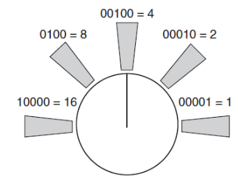

# CSE435 – Robotics
## Lab 5 – RobotBASIC Random Roaming II

---

### Objective

In earlier random roaming programs, the robot reacted to obstacles by turning random amounts, often producing unintelligent movement patterns. This lab introduces improvements to make the robot’s behavior more adaptive and realistic.

### First Improvement - Turning

**Approach:**  
- If the robot encounters an object and the sensors show it to be on its right side, then the robot should turn left.
- If the object is on the left side it should turn right.
- If the object is straight ahead the robot should turn completely around.
- In all these cases, we will add a little randomness to improve the robot’s ability to cope with unforeseen circumstances.

**Remember `rFeel()` Infrared Sensors**  

  

### Second Improvement - Stop Turning When Path is Clear

- The robot now monitors the distance to nearby objects using a range sensor (`rRange()`).
- As it turns, it continuously measures distance:
  - If the distance starts increasing, the robot has found a clear path.
  - If the distance starts decreasing, a new obstacle may be ahead, so it stops turning.