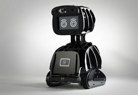
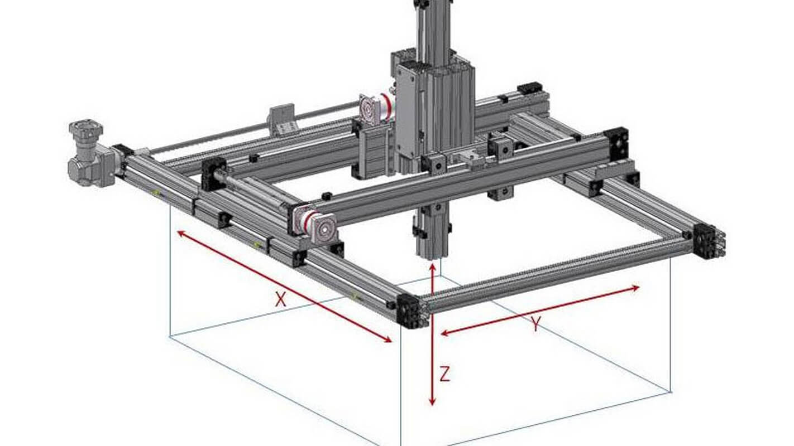

# CSE435 – Robotics  
## Lecture 1 Notes

---

## What is a Robot?

- A **robot** is an automatic machine capable of performing tasks with little or no human intervention.  
- Robots can be **mobile** (move in an environment) or **fixed** (work in a defined space).

---

## Types of Robots

### 1. Mobile Robots

- Robots that move around freely in their environment.  
- **Activities**:
    - Movement (forward, reverse, turning).  
    - Light detection and response (may be affected by ambient lighting).  
    - Proximity sensing (detect nearby objects via reflected light).  
    - Contact sensing (bumpers/antennae to detect obstacles).  
    - Communication (human--robot or robot--robot via Bluetooth, etc.).  
    - Navigation:
        - *Wall-following* (maze solving).  
        - *Line-following* (painted path guidance).  
        - *Homing on light*.  
        - *Free-space navigation* (difficult due to motor errors and slippage but robot tries to estimate its own position).

  

### 2. Gantry Robots (Cartesian Robots)

- Fixed robots operating in a defined **rectangular area**.  
- A gripper/tool is suspended from a movable frame (X--Y control).  
- **Advantages**: precise positioning, cannot lose bearings.  
- **Uses**: industrial automation, handling heavy loads.  

  

---

## Robot Control Concepts

### Feedback in Robotics

- **Negative Feedback**: Maintains stability (e.g., wall-following robot adjusting based on IR sensors).  
- **Positive Feedback**: Causes instability (wrong wiring → veer or crash).
- **Limit Switch Feedback**: Provides safe stopping/control points.

### Random Activity

- Uses pseudo-random behavior (e.g., Monte Carlo Walk).  
- Applications: maze solving, trial-and-error learning, adaptive behaviors.

### Subsumption Architecture

- A layered control method: higher-priority behaviors override lower ones.
- Example: Robot stops homing → switches to avoidance when obstacle detected → resumes homing once clear.

### Distributed Processing

- Splits tasks across multiple controllers.  
- Each runs independently, exchanging signals when needed.  
- Example: Gantry robot with two controllers (main frame + x-frame).
