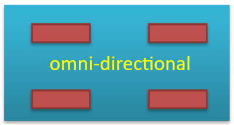
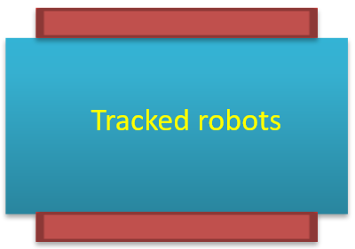

# CSE435 – Robotics  
## Lecture 2 Notes

---

### 📘 Educational Importance

**Mobile robots are widely used for teaching in:**  
- Computer Science  
- Computer & Electrical Engineering  
- Information Technology  
- Mechanical Engineering  

**Advantages in education:**  
- **Tangible Learning:** Robots are real, physical systems — easier for students to understand than simulations.  
- **Real-World Complexity:** Real robots have sensor noise, actuator limits, and mechanical inaccuracies, forcing students to solve realistic engineering problems.  
- **Engagement:** Programming a moving robot is fun, motivating, and often enhanced through competitions between student teams.

---

### 🤖 Types of Mobile Robots

All members of the **EyeBot family** use the **EyeCon embedded controller**.

**Categories:**
- Wheeled Robots  
- Tracked Robots  
- Legged Robots  
- Flying Robots  
- Underwater Robots  

---

### 🚗 Wheeled Robots

The simplest form of mobile robots.

**Main components:**
- One or more **driving wheels**  
- Optional **passive or caster wheels**  
- Possibly **steering wheels**  
- Most designs use **two motors** (for driving and/or steering)

---

#### 🔸 Single Drive/Steer Wheel  

   
  <em>Figure 1: Single Drive/Steer Wheel</em>

- One wheel controlled by **two motors**:  
  - One for **driving**  
  - One for **steering**  
- **Advantages:** Driving and steering are completely independent.  
- **Disadvantages:** Cannot turn on the spot because the driven wheel is off-center.

---

#### 🔸 Differential Drive  

   
  <em>Figure 2: Differential Drive</em>

- Two **independently driven** center wheels.  
- Allows motion in straight lines, curves, or turning on the spot.  
- Steering is achieved by **differential speed control** between the two wheels.

---

#### 🔸 Ackermann Steering  

   
  <em>Figure 3: Ackermann Steering</em>

- Standard **car-like steering system**.  
- **Rear wheels:** Driven by a single motor.  
- **Front wheels:** Steered together by one motor via a linkage mechanism.  

---

#### 🔸 Omni-Directional (Mecanum Drive)  

   
  <em>Figure 4: Omni-Directional (Mecanum) Drive</em>

- Four **independently driven** wheels with special rollers.  
- Can move in any direction (sideways, diagonal, rotate on the spot).  
- **Requires a flat surface** for smooth operation.

---

### 🚜 Tracked Robots  

   
  <em>Figure 5: Tracked Robot</em>

- Use **two parallel tracks** for motion.  
- Can handle **rough or uneven terrain** effectively.  
- Less precise in navigation compared to wheeled robots.  
- Typically require **two motors** — one for each track.

---

### 🦿 Legged Robots

- Move efficiently over **complex terrain or stairs**.  
- **More legs → easier balance.**  
- Example: A six-legged robot always keeps three legs on the ground for stability.  
- Require **multiple motors per leg** (2 or more DOFs).  
- **Biped robots** need active balance control (since only two contact points).  
- Generally more complex, heavy, and costly.

---

### 🔁 Sensor–Actuator–Controller Interaction

- Inspired by **Braitenberg Vehicles (1984)** — showing how simple sensor-motor connections can create complex behaviors.  

**Two main configurations:**

1. **Parallel Connection:**  
   - Left sensor → Left motor  
   - Right sensor → Right motor  
   - Robot moves toward light but may overshoot or miss the target.  

2. **Crossed Connection:**  
   - Left sensor → Right motor  
   - Right sensor → Left motor  
   - Robot steers **toward** the light — smoother tracking behavior.  

💡 *Demonstrates how simple reactive control can produce intelligent-looking motion.*

